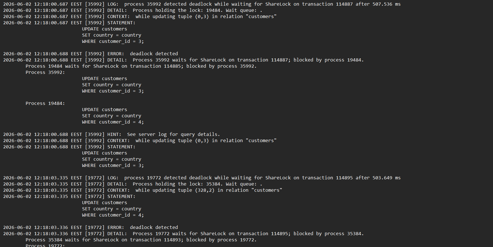
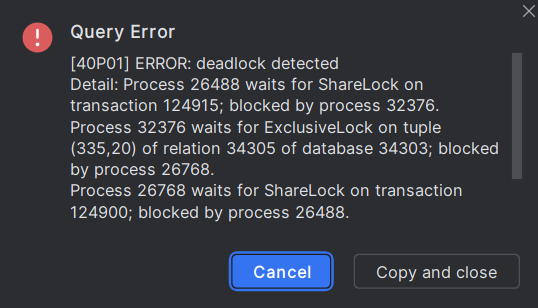
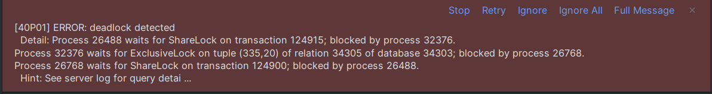

# PostgreSQL Performance Analysis and Optimization

## Preparation
As a first step in this investigation, I added these extensions to the postgers:
* pg_stat_statements: to see all the queries' statistics, such as time they took, number of calls etc.
* pg_trgm: to make use of the trigram index that can optimize filtering by patterns
```sql
CREATE EXTENSION IF NOT EXISTS pg_stat_statements;
CREATE EXTENSION IF NOT EXISTS pg_trgm;
```

After that I executed such a sql query in order to clear the previous statistics that included queries related to schema creation and table seed:
```sql
SELECT pg_stat_statements_reset();
```
Be aware, that after that step I had to wait at least for 5 minutes to gather some useful query data.

## Overall Statistics Before Any Optimization
Then I executed this query to see the statistics:
```sql
SELECT query,calls,
round(total_exec_time::numeric, 2) AS total_ms,
round(mean_exec_time::numeric,  2) AS mean_ms, rows
FROM pg_stat_statements
ORDER BY total_exec_time DESC
LIMIT 10;
```
The **results**:

| query | calls | total\_ms | mean\_ms | rows |
| :--- | :--- | :--- | :--- | :--- |
| UPDATE customers<br/>        SET phone = 'changed\_' \|\| NOW\(\)::TEXT<br/>        WHERE customer\_id = 5 | 419 | 1356336.61 | 3237.08 | 419 |
| UPDATE customers<br/>                    SET country = country<br/>                    WHERE customer\_id = $1 | 205 | 660587.83 | 3222.38 | 205 |
| UPDATE customers<br/>                    SET city = city<br/>                    WHERE customer\_id = $1 | 329 | 639115.28 | 1942.6 | 329 |
| UPDATE customers<br/>                    SET status = $1<br/>                    WHERE customer\_id = $2 | 74 | 132449.14 | 1789.85 | 74 |
| SELECT<br/>                customer\_id,<br/>                event\_type,<br/>                COUNT\(\*\) AS events\_count,<br/>                MAX\(event\_time\) AS last\_event\_time<br/>            FROM customer\_events\_wide<br/>            WHERE event\_time &gt;= NOW\(\) - INTERVAL $1<br/>            GROUP BY customer\_id, event\_type<br/>            ORDER BY events\_count DESC<br/>            LIMIT $2 | 730 | 122266.05 | 167.49 | 146000 |
| SELECT<br/>                p.category,<br/>                COUNT\(\*\) AS items\_sold,<br/>                SUM\(oi.quantity \* oi.unit\_price\) AS revenue<br/>            FROM order\_items oi<br/>            JOIN products p ON oi.product\_id = p.product\_id<br/>            GROUP BY p.category<br/>            ORDER BY revenue DESC | 733 | 112412.24 | 153.36 | 3665 |
| SELECT COUNT\(\*\)<br/>            FROM customers c<br/>            JOIN orders o ON o.customer\_id = c.customer\_id<br/>            JOIN customer\_events\_wide e ON e.customer\_id = c.customer\_id<br/>            WHERE c.status IN \('active', 'inactive'\)<br/>              AND e.event\_time &gt;= NOW\(\) - INTERVAL '90 days' | 746 | 94753.41 | 127.02 | 746 |
| SELECT \*<br/>            FROM orders<br/>            WHERE delivery\_city LIKE $1<br/>              AND status = $2 | 750 | 87509.82 | 116.68 | 12440283 |
| SELECT<br/>                c.customer\_id,<br/>                c.full\_name,<br/>                COUNT\(o.order\_id\) AS orders\_count,<br/>                SUM\(o.total\_amount\) AS revenue<br/>            FROM customers c<br/>            JOIN orders o ON c.customer\_id = o.customer\_id<br/>            WHERE c.status = $1<br/>            GROUP BY c.customer\_id, c.full\_name<br/>            ORDER BY revenue DESC<br/>            LIMIT $2 | 775 | 36587.65 | 47.21 | 77500 |
| SELECT \*<br/>            FROM customers<br/>            WHERE email LIKE $1 | 782 | 2987.22 | 3.82 | 0 |

There are **two main problems** regarding those queries:

* _lock-affection_ (those with `UPDATE` statements): queries try to update the same rows, causing a massive lock contention. 
High mean time means each execution waits a long time for a lock and does nothing at that time -> deadlock.

* _slowness_ (`events_aggregation`, `items_products_join`, `cartesian_pressure`, `orders_by_city_and_status`, `heavy_join`, `search_customer_by_email`): 
all the queries perform the full sequential scans and do not make use of any indices, since none of them exists yet.
That causes a long execution time. Additionally, one of the queries (`cartesian_pressure`) unnecessary joins the `orders` table.

**Overall picture**: the database has two separate and independent problems.
Fixing indexes will not reduce lock wait times, and fixing locks will not speed up read queries — both need to be addressed separately.

_Note_: `search_customer_by_email` is the only query performing acceptably, in comparision to others, likely due to table caching from repeated scans. However, its time can also be speed up.

## Exploration Steps
1) I ran `EXPLAIN ANALYZE` alongside every `SELECT` query to understand what is going on under the hood. 
That statement executes the query and displays the actual execution plan with real execution times, row counts, and resource usage.
The execution plan should be read from the bottom up: the innermost node executes first and its result is passed upward.
Key fields to look at: `cost` (estimated work), `rows` (estimated row count), `actual time` (real execution time in ms), and `Index Cond` (condition used by an index).

2) After the _results exploration_, I created the indices to achieve the optimization and also refactored some of the queries to make use of **CTEs** or avoid **unnecessary joins**.
Indices can speed up the data retrieval, but there are different types of them for various types of usecases. 
The CTEs break down complex queries into simpler parts, enhancing readability and maintainability. 
In addition, they are reusable and may offer better performance, as they can be optimized by the query optimizer.

3) Having applied the necessary optimization, I ran the `VACUUM ANALYZE` for each table to update the planner statistics and reclaim the space from the dead tuples.
It is necessary to use it after the heavy UPDATE workload from the load script, because PostgreSQL does not immediately remove old row versions on UPDATE or DELETE. 
It just marks them as dead tuples that take up space and confuse the planner's row estimates until VACUUM cleans them up.

```sql
VACUUM ANALYZE customers;
VACUUM ANALYZE orders;
VACUUM ANALYZE order_items;
VACUUM ANALYZE products;
VACUUM ANALYZE customer_events_wide;
```

4) I executed the `EXPLAIN ANALYZE` statement one more time for each `SELECT` query to compare the results and understand what was truly improved.


## Each `SELECT` Query Dive Deep

### `search_customer_by_email`

```sql
SELECT *
FROM customers
WHERE email LIKE '%gmail%';
```

**BEFORE**:

| QUERY PLAN |
| :--- |
| Seq Scan on customers  \(cost=0.00..594.06 rows=2 width=96\) \(actual time=4.197..4.198 rows=0 loops=1\) |
|   Filter: \(email \~\~ '%gmail%'::text\) |
|   Rows Removed by Filter: 20000 |
| Planning Time: 1.545 ms |
| Execution Time: 4.215 ms |

The query performs the full sequential scan on the `customers` table and the execution time is longer than the planning time.
This happens because a standard B-tree index cannot handle a leading-wildcard `LIKE` pattern such as `'%gmail%'`: it requires the pattern to be anchored to the beginning of the string.
Since the wildcard appears at the start, PostgreSQL has no choice but to read every row and apply the filter manually, removing all 20 000 rows one by one.
GIN trigram index from the `pg_trgm` extension can be useful for the `LIKE` patterns within the `WHERE` clauses.
That index was created for the `email` column.

```sql
CREATE INDEX IF NOT EXISTS index_customers_email ON customers USING gin (email gin_trgm_ops);
```

**AFTER**:

| QUERY PLAN |
| :--- |
| Bitmap Heap Scan on customers  \(cost=32.02..39.58 rows=2 width=96\) \(actual time=0.038..0.039 rows=0 loops=1\) |
|   Recheck Cond: \(email \~\~ '%gmail%'::text\) |
|   -&gt;  Bitmap Index Scan on index\_customers\_email  \(cost=0.00..32.01 rows=2 width=0\) \(actual time=0.036..0.036 rows=0 loops=1\) |
|         Index Cond: \(email \~\~ '%gmail%'::text\) |
| Planning Time: 1.308 ms |
| Execution Time: 0.092 ms |

The **results**:
* the execution time is 45 times less than it was before and even less than the planning time
* the scan changed from a full `Seq Scan` to a `Bitmap Heap Scan`, meaning PostgreSQL now uses the index to identify matching rows first and only then fetches them from the table
* the created index was utilized: confirmed by `Index Cond: (email ~~ '%gmail%'::text)` appearing in the plan

By the way, I would like to note, that it's better to not use `*` as a selector, since it loads all the fields, which may be expensive.
It's more appropriate to select only the fields you really need.

### `orders_by_city_and_status`

```sql
SELECT *
FROM orders
WHERE delivery_city LIKE '%a%'
  AND status = 'paid';
```

**BEFORE**:

| QUERY PLAN |
| :--- |
| Seq Scan on orders  \(cost=0.00..3027.00 rows=16324 width=50\) \(actual time=0.015..26.404 rows=16930 loops=1\) |
|   Filter: \(\(delivery\_city \~\~ '%a%'::text\) AND \(status = 'paid'::text\)\) |
|   Rows Removed by Filter: 103070 |
| Planning Time: 1.810 ms |
| Execution Time: 26.975 ms |

The query performs the full sequential scan on the `orders` table and the execution time is also longer than the planning time.
The same leading-wildcard problem applies to `delivery_city LIKE '%a%'`: a B-tree index is useless here. 
Additionally, the `status` column has no index either, so both filter conditions are evaluated row by row across all 120 000 orders, 
with 103 070 rows discarded after being read.

I tried to optimize it with 2 indices:
* GIN trigram index for the `LIKE` pattern on `delivery_city`:
```sql
CREATE INDEX IF NOT EXISTS index_orders_city ON orders USING gin (delivery_city gin_trgm_ops);
```
* B-tree (the default one) on the `status` column, that will act as an equality filter within the `WHERE` clause:
```sql
CREATE INDEX IF NOT EXISTS index_orders_status ON orders (status);
```

As in the case above, it's more appropriate to select only the fields you really need, without the `*` selector.

**AFTER**:

| QUERY PLAN |
| :--- |
| Bitmap Heap Scan on orders  \(cost=288.37..1902.53 rows=17977 width=49\) \(actual time=1.573..12.464 rows=17463 loops=1\) |
|   Recheck Cond: \(status = 'paid'::text\) |
|   Filter: \(delivery\_city \~\~ '%a%'::text\) |
|   Rows Removed by Filter: 8281 |
|   Heap Blocks: exact=1231 |
|   -&gt;  Bitmap Index Scan on index\_orders\_status  \(cost=0.00..283.87 rows=25544 width=0\) \(actual time=1.308..1.308 rows=25753 loops=1\) |
|         Index Cond: \(status = 'paid'::text\) |
| Planning Time: 4.084 ms |
| Execution Time: 13.283 ms |

The **results**:
* the execution time is 2 times less than it was before, but it's bigger than the planning time
* the scan changed from `Seq Scan` to `Bitmap Heap Scan`: PostgreSQL now uses `index_orders_status` to pre-filter the `paid` rows only, then applies the `delivery_city` filter on that smaller set
* the number of rows removed by filter dropped from 103,070 to 8,281, confirming that the status index significantly narrowed the working set before the LIKE check was applied
* the planner chose the B-tree `status` index over the GIN `delivery_city` index because equality on a low-cardinality column (`status` has only ~5 distinct values) is more selective in this data distribution

### `heavy_join`

```sql
SELECT
c.customer_id,
c.full_name,
COUNT(o.order_id) AS orders_count,
SUM(o.total_amount) AS revenue
FROM customers c
JOIN orders o ON c.customer_id = o.customer_id
WHERE c.status = 'active'
GROUP BY c.customer_id, c.full_name
ORDER BY revenue DESC
LIMIT 100;
```

**BEFORE**:

| QUERY PLAN |
| :--- |
| Limit  \(cost=4073.47..4073.72 rows=100 width=58\) \(actual time=86.720..86.750 rows=100 loops=1\) |
|   -&gt;  Sort  \(cost=4073.47..4090.65 rows=6873 width=58\) \(actual time=86.717..86.732 rows=100 loops=1\) |
|         Sort Key: \(sum\(o.total\_amount\)\) DESC |
|         Sort Method: top-N heapsort  Memory: 38kB |
|         -&gt;  HashAggregate  \(cost=3724.87..3810.78 rows=6873 width=58\) \(actual time=78.153..83.205 rows=6672 loops=1\) |
|               Group Key: c.customer\_id |
|               Batches: 1  Memory Usage: 3281kB |
|               -&gt;  Hash Join  \(cost=681.73..3423.79 rows=40144 width=28\) \(actual time=5.411..52.345 rows=39879 loops=1\) |
|                     Hash Cond: \(o.customer\_id = c.customer\_id\) |
|                     -&gt;  Seq Scan on orders o  \(cost=0.00..2427.00 rows=120000 width=14\) \(actual time=0.015..13.665 rows=120000 loops=1\) |
|                     -&gt;  Hash  \(cost=595.81..595.81 rows=6873 width=18\) \(actual time=5.372..5.373 rows=6693 loops=1\) |
|                           Buckets: 8192  Batches: 1  Memory Usage: 393kB |
|                           -&gt;  Seq Scan on customers c  \(cost=0.00..595.81 rows=6873 width=18\) \(actual time=0.012..4.033 rows=6693 loops=1\) |
|                                 Filter: \(status = 'active'::text\) |
|                                 Rows Removed by Filter: 13307 |
| Planning Time: 0.968 ms |
| Execution Time: 87.555 ms |

The plan reads the entire `customers` table (20 000 rows) via `Seq Scan` just to filter down to 6 693 active customers, discarding 13 307 rows. 
It then performs a full `Seq Scan` on all 120 000 orders to build a hash table for the join.
Both scans are unavoidable without indexes because the planner does not have a shortcut to see only `active` customers or to take orders by `customer_id` efficiently.

I decided to create a B-tree index on the `status` column within the `customers` table because this field is referred to in the `WHERE` clause:
```sql
CREATE INDEX IF NOT EXISTS index_customers_status ON customers (status);
```

**AFTER**:

| QUERY PLAN |
| :--- |
| Limit  \(cost=3991.52..3991.77 rows=100 width=58\) \(actual time=39.204..39.232 rows=100 loops=1\) |
|   -&gt;  Sort  \(cost=3991.52..4008.25 rows=6693 width=58\) \(actual time=39.200..39.215 rows=100 loops=1\) |
|         Sort Key: \(sum\(o.total\_amount\)\) DESC |
|         Sort Method: top-N heapsort  Memory: 38kB |
|         -&gt;  HashAggregate  \(cost=3652.06..3735.72 rows=6693 width=58\) \(actual time=31.014..35.997 rows=6672 loops=1\) |
|               Group Key: c.customer\_id |
|               Batches: 1  Memory Usage: 3281kB |
|               -&gt;  Hash Join  \(cost=587.48..3349.16 rows=40386 width=28\) \(actual time=1.909..20.270 rows=39879 loops=1\) |
|                     Hash Cond: \(o.customer\_id = c.customer\_id\) |
|                     -&gt;  Seq Scan on orders o  \(cost=0.00..2444.82 rows=120682 width=14\) \(actual time=0.011..7.069 rows=120000 loops=1\) |
|                     -&gt;  Hash  \(cost=503.82..503.82 rows=6693 width=18\) \(actual time=1.872..1.874 rows=6693 loops=1\) |
|                           Buckets: 8192  Batches: 1  Memory Usage: 393kB |
|                           -&gt;  Bitmap Heap Scan on customers c  \(cost=80.16..503.82 rows=6693 width=18\) \(actual time=0.179..1.236 rows=6693 loops=1\) |
|                                 Recheck Cond: \(status = 'active'::text\) |
|                                 Heap Blocks: exact=340 |
|                                 -&gt;  Bitmap Index Scan on index\_customers\_status  \(cost=0.00..78.48 rows=6693 width=0\) \(actual time=0.152..0.152 rows=6871 loops=1\) |
|                                       Index Cond: \(status = 'active'::text\) |
| Planning Time: 13.525 ms |
| Execution Time: 40.361 ms |


The **results**:
* the execution time is 2 times less than it was before, but it's bigger than the planning time
* the `Seq Scan` on `customers` was replaced by a `Bitmap Heap Scan` using `index_customers_status`, reducing the customer scan from reading all 20 000 rows to fetching only 6 693 active ones directly
* the Hash Join itself became faster as a result: building the hash table dropped from 5.4 ms to 1.9 ms because the input is now smaller
* the `orders` table still uses a `Seq Scan` because joining all orders against matched customers is more efficient than an index lookup when a large fraction of orders is expected to match. That is why I dropped the previously created B-tree index on the `customer_id` column from the `orders` table, because I saw it has no effect.


### `events_aggregation`

```sql
SELECT
customer_id,
event_type,
COUNT(*) AS events_count,
MAX(event_time) AS last_event_time
FROM customer_events_wide
WHERE event_time >= NOW() - INTERVAL '180 days'
GROUP BY customer_id, event_type
ORDER BY events_count DESC
LIMIT 200;
```

**BEFORE**:

| QUERY PLAN |
| :--- |
| Limit  \(cost=14954.25..14954.75 rows=200 width=27\) \(actual time=373.302..373.339 rows=200 loops=1\) |
|   -&gt;  Sort  \(cost=14954.25..15006.12 rows=20746 width=27\) \(actual time=373.299..373.316 rows=200 loops=1\) |
|         Sort Key: \(count\(\*\)\) DESC |
|         Sort Method: top-N heapsort  Memory: 48kB |
|         -&gt;  HashAggregate  \(cost=13850.17..14057.63 rows=20746 width=27\) \(actual time=291.903..353.648 rows=62594 loops=1\) |
|               Group Key: customer\_id, event\_type |
|               Batches: 5  Memory Usage: 8241kB  Disk Usage: 696kB |
|               -&gt;  Seq Scan on customer\_events\_wide  \(cost=0.00..12820.49 rows=102968 width=19\) \(actual time=0.029..191.882 rows=98430 loops=1\) |
|                     Filter: \(event\_time &gt;= \(now\(\) - '180 days'::interval\)\) |
|                     Rows Removed by Filter: 101570 rows=1\) |
| Planning Time: 2.808 ms |
| Execution Time: 387.709 ms |

The execution time is not fast and is higher than the planning time.
The table has 200 000 rows but the query needs only those within the last 180 days. 
Without any index on the `event_time` column, PostgreSQL reads all 200 000 rows and then discards 101 570 that fall outside the time range.
The `HashAggregate` also spills to disk (`Disk Usage: 696kB`), meaning the aggregation result set is too large to fit in memory, that is further slowing down the query.

The **composite** index, comprising the `event_time`, `customer_id` and the `event_type` columns, can help here.
The `event_time` column should go first, since it is used within the `WHERE` clause as a filtering condition.
Then `customer_id` and `event_type` columns should go to cover the `GROUP BY` clause.
By including all three columns the index becomes a **covering index** for this query:
PostgreSQL can satisfy the filter and the grouping entirely from the index without going back to the table for each row.

```sql
CREATE INDEX IF NOT EXISTS index_customer_events_wide_time_customer_type ON customer_events_wide (event_time, customer_id, event_type);
```

**AFTER**:

| QUERY PLAN |
| :--- |
| Limit  \(cost=6056.55..6057.05 rows=200 width=27\) \(actual time=126.005..126.047 rows=200 loops=1\) |
|   -&gt;  Sort  \(cost=6056.55..6106.49 rows=19977 width=27\) \(actual time=126.002..126.020 rows=200 loops=1\) |
|         Sort Key: \(count\(\*\)\) DESC |
|         Sort Method: top-N heapsort  Memory: 48kB |
|         -&gt;  HashAggregate  \(cost=4993.38..5193.15 rows=19977 width=27\) \(actual time=71.579..107.354 rows=62522 loops=1\) |
|               Group Key: customer\_id, event\_type |
|               Batches: 5  Memory Usage: 8241kB  Disk Usage: 688kB |
|               -&gt;  Index Only Scan using index\_customer\_events\_wide\_time\_customer\_type on customer\_events\_wide  \(cost=0.42..4011.21 rows=98217 width=19\) \(actual time=0.025..23.318 rows=98243 loops=1\) |
|                     Index Cond: \(event\_time &gt;= \(now\(\) - '180 days'::interval\)\) |
|                     Heap Fetches: 9148 |
| Planning Time: 0.135 ms |
| Execution Time: 148.150 ms |

The **results**:
* the execution time dropped from 387 ms to 148 ms 
* the scan changed from `Seq Scan` to `Index Only Scan`, meaning PostgreSQL reads directly from the index without touching the main table
* the total cost estimate dropped from  approximately 15,000 to 6,857, reflecting that far fewer pages need to be read
* the `HashAggregate` still spills to disk because the number of distinct `(customer_id, event_type)` combinations is large. I believe this is a data volume issue rather than an indexing issue

### `items_products_join`

```sql
SELECT
p.category,
COUNT(*) AS items_sold,
SUM(oi.quantity * oi.unit_price) AS revenue
FROM order_items oi
JOIN products p ON oi.product_id = p.product_id
GROUP BY p.category
ORDER BY revenue DESC;
```

**BEFORE**:

| QUERY PLAN |
| :--- |
| Sort  \(cost=8679.49..8679.51 rows=5 width=47\) \(actual time=217.224..223.843 rows=5 loops=1\) |
|   Sort Key: \(sum\(\(\(oi.quantity\)::numeric \* oi.unit\_price\)\)\) DESC |
|   Sort Method: quicksort  Memory: 25kB |
|   -&gt;  Finalize GroupAggregate  \(cost=8678.75..8679.44 rows=5 width=47\) \(actual time=217.206..223.835 rows=5 loops=1\) |
|         Group Key: p.category |
|         -&gt;  Gather Merge  \(cost=8678.75..8679.32 rows=5 width=47\) \(actual time=217.195..223.816 rows=10 loops=1\) |
|               Workers Planned: 1 |
|               Workers Launched: 1 |
|               -&gt;  Sort  \(cost=7678.74..7678.75 rows=5 width=47\) \(actual time=183.042..183.044 rows=5 loops=2\) |
|                     Sort Key: p.category |
|                     Sort Method: quicksort  Memory: 25kB |
|                     Worker 0:  Sort Method: quicksort  Memory: 25kB |
|                     -&gt;  Partial HashAggregate  \(cost=7678.62..7678.68 rows=5 width=47\) \(actual time=182.994..182.998 rows=5 loops=2\) |
|                           Group Key: p.category |
|                           Batches: 1  Memory Usage: 24kB |
|                           Worker 0:  Batches: 1  Memory Usage: 24kB |
|                           -&gt;  Hash Join  \(cost=66.00..5032.63 rows=211679 width=17\) \(actual time=1.020..76.336 rows=179928 loops=2\) |
|                                 Hash Cond: \(oi.product\_id = p.product\_id\) |
|                                 -&gt;  Parallel Seq Scan on order\_items oi  \(cost=0.00..4409.79 rows=211679 width=14\) \(actual time=0.005..17.509 rows=179928 loops=2\) |
|                                 -&gt;  Hash  \(cost=41.00..41.00 rows=2000 width=11\) \(actual time=0.984..0.985 rows=2000 loops=2\) |
|                                       Buckets: 2048  Batches: 1  Memory Usage: 104kB |
|                                       -&gt;  Seq Scan on products p  \(cost=0.00..41.00 rows=2000 width=11\) \(actual time=0.359..0.622 rows=2000 loops=2\) |
| Planning Time: 3.561 ms |
| Execution Time: 224.022 ms |

The bottleneck here is that all `order_items` rows are joined against `products` before any aggregation happens. 
PostgreSQL performs a full `Parallel Seq Scan` on `order_items` and builds a hash table from all `products` rows, then only aggregates the result. 
The join happens at the raw row level: every individual order item is matched to its product, before the grouping by category is applied. 
This is unnecessarily expensive because only 5 category-level totals are needed at the end.

I rewrote this query to make use of CTE, which avoids joining the full `order_items` table against the `products` table.
The CTE pre-aggregates `order_items` by `product_id` first, reducing the 360,000-row table to 2,000 rows (one per product) before the join with `products` takes place. This means the Hash Join works on 2,000 rows instead of 360,000.

Previously, I created a B-tree index on the `product_id` column within the `order_items` table, since that is the one used for joining the tables. 
However, having run the analysis, I observed that it has no effect and I dropped it.

```sql
WITH item_totals AS (
SELECT product_id, COUNT(*) AS items_sold,
    SUM(quantity * unit_price) AS revenue
FROM order_items
GROUP BY product_id
)
SELECT p.category, SUM(it.items_sold) AS items_sold,
SUM(it.revenue) AS revenue
FROM item_totals it
JOIN products p ON it.product_id = p.product_id
GROUP BY p.category
ORDER BY revenue DESC;
```
**AFTER**:

| QUERY PLAN |
| :--- |
| Sort  \(cost=8432.18..8432.19 rows=5 width=71\) \(actual time=105.285..105.430 rows=5 loops=1\) |
|   Sort Key: \(sum\(\(sum\(\(\(order\_items.quantity\)::numeric \* order\_items.unit\_price\)\)\)\)\) DESC |
|   Sort Method: quicksort  Memory: 25kB |
|   -&gt;  HashAggregate  \(cost=8432.04..8432.12 rows=5 width=71\) \(actual time=105.237..105.385 rows=5 loops=1\) |
|         Group Key: p.category |
|         Batches: 1  Memory Usage: 24kB |
|         -&gt;  Hash Join  \(cost=8366.78..8417.04 rows=2000 width=47\) \(actual time=102.230..104.334 rows=2000 loops=1\) |
|               Hash Cond: \(order\_items.product\_id = p.product\_id\) |
|               -&gt;  Finalize HashAggregate  \(cost=8300.78..8325.78 rows=2000 width=44\) \(actual time=101.769..103.123 rows=2000 loops=1\) |
|                     Group Key: order\_items.product\_id |
|                     Batches: 1  Memory Usage: 1393kB |
|                     -&gt;  Gather  \(cost=8055.78..8280.78 rows=2000 width=44\) \(actual time=94.689..97.019 rows=4000 loops=1\) |
|                           Workers Planned: 1 |
|                           Workers Launched: 1 |
|                           -&gt;  Partial HashAggregate  \(cost=7055.78..7080.78 rows=2000 width=44\) \(actual time=78.933..79.945 rows=2000 loops=2\) |
|                                 Group Key: order\_items.product\_id |
|                                 Batches: 1  Memory Usage: 1137kB |
|                                 Worker 0:  Batches: 1  Memory Usage: 1137kB |
|                                 -&gt;  Parallel Seq Scan on order\_items  \(cost=0.00..4409.79 rows=211679 width=14\) \(actual time=0.004..10.933 rows=179928 loops=2\) |
|               -&gt;  Hash  \(cost=41.00..41.00 rows=2000 width=11\) \(actual time=0.443..0.444 rows=2000 loops=1\) |
|                     Buckets: 2048  Batches: 1  Memory Usage: 104kB |
|                     -&gt;  Seq Scan on products p  \(cost=0.00..41.00 rows=2000 width=11\) \(actual time=0.044..0.178 rows=2000 loops=1\) |
| Planning Time: 0.484 ms |
| Execution Time: 106.939 ms |

The **results**:
* the execution time is two times less than it was before (224 ms → 107 ms)
* the Hash Join now operates on 2000 pre-aggregated rows instead of 360000 raw rows: it's visible in the plan where `rows=2000` appears at the join node instead of `rows=211679`
* the query no longer needs a second sort pass for parallelism coordination (`Gather Merge` is gone), replaced by a simpler single `HashAggregate` at the top level
* planning time also dropped from 3.5 ms to 0.5 ms because the simpler query shape is faster for the optimizer to reason about


### `cartesian_pressure`

```sql
 SELECT COUNT(*)
FROM customers c
JOIN orders o ON o.customer_id = c.customer_id
JOIN customer_events_wide e ON e.customer_id = c.customer_id
WHERE c.status IN ('active', 'inactive')
  AND e.event_time >= NOW() - INTERVAL '90 days';
```

**BEFORE**:

| QUERY PLAN |
| :--- |
| Finalize Aggregate  \(cost=15733.44..15733.45 rows=1 width=8\) \(actual time=215.937..232.669 rows=1 loops=1\) |
|   -&gt;  Gather  \(cost=15733.33..15733.44 rows=1 width=8\) \(actual time=215.930..232.663 rows=2 loops=1\) |
|         Workers Planned: 1 |
|         Workers Launched: 1 |
|         -&gt;  Partial Aggregate  \(cost=14733.33..14733.34 rows=1 width=8\) \(actual time=177.467..178.832 rows=1 loops=2\) |
|               -&gt;  Parallel Hash Join  \(cost=11719.57..14415.46 rows=127150 width=0\) \(actual time=120.854..165.708 rows=98080 loops=2\) |
|                     Hash Cond: \(o.customer\_id = c.customer\_id\) |
|                     -&gt;  Parallel Seq Scan on orders o  \(cost=0.00..1934.46 rows=70646 width=4\) \(actual time=0.052..6.835 rows=60000 loops=2\) |
|                     -&gt;  Parallel Hash  \(cost=11539.09..11539.09 rows=14439 width=8\) \(actual time=119.850..121.212 rows=16368 loops=2\) |
|                           Buckets: 65536  Batches: 1  Memory Usage: 1824kB |
|                           -&gt;  Hash Join  \(cost=766.55..11539.09 rows=14439 width=8\) \(actual time=7.303..102.207 rows=16368 loops=2\) |
|                                 Hash Cond: \(e.customer\_id = c.customer\_id\) |
|                                 -&gt;  Parallel Seq Scan on customer\_events\_wide e  \(cost=0.00..10715.51 rows=21719 width=4\) \(actual time=0.013..85.246 rows=24638 loops=2\) |
|                                       Filter: \(event\_time &gt;= \(now\(\) - '90 days'::interval\)\) |
|                                       Rows Removed by Filter: 75362 |
|                                 -&gt;  Hash  \(cost=595.81..595.81 rows=13659 width=4\) \(actual time=7.188..7.189 rows=13298 loops=2\) |
|                                       Buckets: 16384  Batches: 1  Memory Usage: 596kB |
|                                       -&gt;  Seq Scan on customers c  \(cost=0.00..595.81 rows=13659 width=4\) \(actual time=0.253..4.990 rows=13298 loops=2\) |
|                                             Filter: \(status = ANY \('{active,inactive}'::text\[\]\)\) |
|                                             Rows Removed by Filter: 6702 |
| Planning Time: 0.764 ms |
| Execution Time: 232.809 ms |

This query has two problems visible in the plan. 
First, the `orders` table is joined even though no `orders` column appears in the `SELECT`.
It contributes nothing to the result and only inflates the intermediate row count, which reaches 127 150 estimated rows before aggregation. 
Second, `customer_events_wide` has no index on `event_time`.
That is why PostgreSQL must scan all 200 000 rows and discard 75 362 that fall outside the 90-day window.
The combination of the unnecessary join and the full scan makes this query significantly slower than it needs to be.

```sql
CREATE INDEX IF NOT EXISTS index_customer_events_wide_customer ON customer_events_wide (customer_id);
```

Then I removed the unnecessary `orders` table from the join. 
That is because the original query never uses any columns from the `orders` table in the `SELECT` clause.

Note, a B-tree index on the `customer_id` column within the `customer_events_wide` table, that is used for joining the tables, has no effect on this query.

```sql
SELECT COUNT(*)
FROM customers c
JOIN customer_events_wide e ON e.customer_id = c.customer_id
WHERE c.status IN ('active', 'inactive') AND e.event_time >= NOW() - INTERVAL '90 days';
```

**AFTER**:

| QUERY PLAN |
| :--- |
| Aggregate  \(cost=3926.60..3926.61 rows=1 width=8\) \(actual time=70.087..70.090 rows=1 loops=1\) |
|   -&gt;  Hash Join  \(cost=756.65..3844.06 rows=33018 width=0\) \(actual time=7.934..67.673 rows=32732 loops=1\) |
|         Hash Cond: \(e.customer\_id = c.customer\_id\) |
|         -&gt;  Index Only Scan using index\_customer\_events\_wide\_time\_customer\_type on customer\_events\_wide e  \(cost=0.42..2957.46 rows=49659 width=4\) \(actual time=0.023..37.372 rows=49271 loops=1\) |
|               Index Cond: \(event\_time &gt;= \(now\(\) - '90 days'::interval\)\) |
|               Heap Fetches: 17088 |
|         -&gt;  Hash  \(cost=590.00..590.00 rows=13298 width=4\) \(actual time=7.828..7.830 rows=13298 loops=1\) |
|               Buckets: 16384  Batches: 1  Memory Usage: 596kB |
|               -&gt;  Seq Scan on customers c  \(cost=0.00..590.00 rows=13298 width=4\) \(actual time=0.025..5.400 rows=13298 loops=1\) |
|                     Filter: \(status = ANY \('{active,inactive}'::text\[\]\)\) |
|                     Rows Removed by Filter: 6702 |
| Planning Time: 0.458 ms |
| Execution Time: 70.277 ms |


The **results**:
* the execution time dropped from 232 ms to 70 ms
* the `orders` table is completely gone from the plan, eliminating the three-way join and the 127 150-row intermediate result
* the `Seq Scan` on `customer_events_wide` was replaced by an `Index Only Scan` using the composite index created for `events_aggregation` . So, the same index perfectly serves both queries
* parallelism (`Gather`, `Workers`) is no longer needed because the query is now simple enough to run efficiently in a single process
* the `customers` table still uses a `Seq Scan` because `status IN ('active', 'inactive')` matches the majority of customers, making a full scan cheaper than an index lookup in this case


## Final Statistics

Having applied all the optimization techniques mentioned above, I reset the previous statistics:
```sql
SELECT pg_stat_statements_reset();
```
Then I waited for some time and checked the new results:

```sql
SELECT query,calls,
round(total_exec_time::numeric, 2) AS total_ms,
round(mean_exec_time::numeric, 2) AS mean_ms, rows
FROM pg_stat_statements
ORDER BY total_exec_time DESC
LIMIT 10;
```

**Results**:

| query | calls | total\_ms | mean\_ms | rows |
| :--- | :--- | :--- | :--- | :--- |
| UPDATE customers<br/>        SET phone = 'changed\_' \|\| NOW\(\)::TEXT<br/>        WHERE customer\_id = 1 | 688 | 1879990.61 | 2732.54 | 688 |
| UPDATE customers<br/>                    SET city = city<br/>                    WHERE customer\_id = $1 | 569 | 732863.11 | 1287.98 | 569 |
| UPDATE customers<br/>                    SET status = $1<br/>                    WHERE customer\_id = $2 | 133 | 263237.66 | 1979.23 | 133 |
| UPDATE customers<br/>                    SET country = country<br/>                    WHERE customer\_id = $1 | 547 | 229109.28 | 418.85 | 547 |
| SELECT<br/>                customer\_id,<br/>                event\_type,<br/>                COUNT\(\*\) AS events\_count,<br/>                MAX\(event\_time\) AS last\_event\_time<br/>            FROM customer\_events\_wide<br/>            WHERE event\_time &gt;= NOW\(\) - INTERVAL $1<br/>            GROUP BY customer\_id, event\_type<br/>            ORDER BY events\_count DESC<br/>            LIMIT $2 | 1483 | 205631.98 | 138.66 | 296600 |
| WITH item\_totals AS \(<br/>                SELECT product\_id, COUNT\(\*\) AS items\_sold,<br/>                    SUM\(quantity \* unit\_price\) AS revenue<br/>                FROM order\_items<br/>                GROUP BY product\_id<br/>            \)<br/>            SELECT p.category, SUM\(it.items\_sold\) AS items\_sold,<br/>                SUM\(it.revenue\) AS revenue<br/>            FROM item\_totals it<br/>            JOIN products p ON it.product\_id = p.product\_id<br/>            GROUP BY p.category<br/>            ORDER BY revenue DESC | 1502 | 150752.05 | 100.37 | 7510 |
| SELECT COUNT\(\*\)<br/>            FROM customers c<br/>            JOIN customer\_events\_wide e ON e.customer\_id = c.customer\_id<br/>            WHERE c.status IN \($1, $2\) AND e.event\_time &gt;= NOW\(\) - INTERVAL $3 | 1434 | 76200.45 | 53.14 | 1434 |
| SELECT<br/>                c.customer\_id,<br/>                c.full\_name,<br/>                COUNT\(o.order\_id\) AS orders\_count,<br/>                SUM\(o.total\_amount\) AS revenue<br/>            FROM customers c<br/>            JOIN orders o ON c.customer\_id = o.customer\_id<br/>            WHERE c.status = $1<br/>            GROUP BY c.customer\_id, c.full\_name<br/>            ORDER BY revenue DESC<br/>            LIMIT $2 | 1439 | 59406.15 | 41.28 | 143900 |
| SELECT \*<br/>            FROM orders<br/>            WHERE delivery\_city LIKE $1<br/>              AND status = $2 | 1470 | 41046.01 | 27.92 | 32063403 |
| UPDATE orders<br/>        SET status = $1<br/>        WHERE order\_id = $2 | 1167 | 1572.71 | 1.35 | 1167 |

**Lock queries**: means dropped across the board. Notably `country` dropped from 3,222 ms to 418 ms 
and `city` from 1,942 ms to 1,287 ms. This confirms that fixing the lock acquisition order in the 
deadlock workers reduced the number of rollbacks and retries, shortening the overall lock queue.

**Read queries**:

| Query | Before mean\_ms | After mean\_ms |
|---|---|---|
| `events_aggregation` | 167 ms | 138 ms |
| `items_products_join` | 153 ms | 100 ms |
| `cartesian_pressure` | 127 ms | 53 ms |
| `orders_by_city_and_status` | 116 ms | 27 ms |
| `heavy_join` | 47 ms | 41 ms |

The biggest gains are `orders_by_city_and_status` and `cartesian_pressure`.
`UPDATE orders` at 1.35 ms confirms row-level writes to `orders` are healthy and no longer blocked for so long.

## Deadlocks

In order to review the whole situation I did the following:
1. Identified the existing locks and the blocking processes:
```sql
SELECT blocked.pid AS blocked_pid,
blocked.usename AS blocked_user,
blocked.query AS blocked_query,
blocking.pid AS blocking_pid,
blocking.usename AS blocking_user,
blocking.query AS blocking_query,
blocked.wait_event_type, blocked.wait_event
FROM pg_stat_activity blocked
JOIN pg_stat_activity blocking
ON blocking.pid = ANY(pg_blocking_pids(blocked.pid))
ORDER BY blocked.pid;
```
| blocked\_pid | blocked\_user | blocked\_query | blocking\_pid | blocking\_user | blocking\_query | wait\_event\_type | wait\_event |
| :--- | :--- | :--- | :--- | :--- | :--- | :--- | :--- |
| 8904 | postgres | <br/>                    UPDATE customers<br/>                    SET country = country<br/>                    WHERE customer\_id = 4;<br/>                 | 33880 | postgres | <br/>                    UPDATE customers<br/>                    SET status = 'active'<br/>                    WHERE customer\_id = 4;<br/>                 | Lock | tuple |
| 11656 | postgres | <br/>        SET lock\_timeout = '20s';<br/>        UPDATE customers<br/>        SET phone = 'changed\_' \|\| NOW\(\)::TEXT<br/>        WHERE customer\_id = 3;<br/>         | 8904 | postgres | <br/>                    UPDATE customers<br/>                    SET country = country<br/>                    WHERE customer\_id = 4;<br/>                 | Lock | transactionid |
| 12348 | postgres | <br/>                    UPDATE customers<br/>                    SET city = city<br/>                    WHERE customer\_id = 4;<br/>                 | 8904 | postgres | <br/>                    UPDATE customers<br/>                    SET country = country<br/>                    WHERE customer\_id = 4;<br/>                 | Lock | tuple |
| 12348 | postgres | <br/>                    UPDATE customers<br/>                    SET city = city<br/>                    WHERE customer\_id = 4;<br/>                 | 33880 | postgres | <br/>                    UPDATE customers<br/>                    SET status = 'active'<br/>                    WHERE customer\_id = 4;<br/>                 | Lock | tuple |
| 33880 | postgres | <br/>                    UPDATE customers<br/>                    SET status = 'active'<br/>                    WHERE customer\_id = 4;<br/>                 | 12948 | postgres | <br/>                    UPDATE customers<br/>                    SET status = 'active'<br/>                    WHERE customer\_id = 4;<br/>                 | Lock | transactionid |

The table confirms that multiple transactions are blocked on the same customer rows simultaneously. 
The `wait_event = 'tuple'` entries mean a transaction is waiting to lock a specific row version that another transaction already holds. 
The `wait_event = 'transactionid'` entries mean a transaction is waiting for another transaction to finish entirely before it can proceed. 
This is the signature of hot-row contention: too many concurrent writers are trying to reach the same small set of rows.

2. Checked which locks are currently not granted using `pg_locks`:
```sql
SELECT pid, relation::regclass, mode, granted, locktype
FROM pg_locks
WHERE NOT granted;
```

| pid | relation | mode | granted | locktype |
| :--- | :--- | :--- | :--- | :--- |
| 22492 | orders | RowExclusiveLock | false | relation |
| 9024 | null | ShareLock | false | transactionid |

The result confirms two ungranted locks at the time of capture:
* pid `22492` is waiting for a `RowExclusiveLock` on the `orders` relation. This is the `orders_writer_worker` blocked by `table_lock_worker`. The `locktype = relation` confirms it is a table-level lock.
* pid `9024` is waiting for a `ShareLock` on a `transactionid`. This is a session waiting for another transaction to finish before it can proceed with its own row update.

3. Checked which sessions are currently waiting for a lock:
```sql
SELECT pid, usename, state, wait_event_type, wait_event,
query_start, now() - query_start AS running_for, query
FROM pg_stat_activity
WHERE wait_event_type = 'Lock';
```

| pid | usename | state | wait\_event\_type | wait\_event | query\_start | running\_for | query |
| :--- | :--- | :--- | :--- | :--- | :--- | :--- | :--- |
| 32284 | postgres | active | Lock | transactionid | 2026-06-02 09:35:49.404564 +00:00 | 0 years 0 mons 0 days 0 hours 0 mins 2.471547 secs | <br/>                    UPDATE customers<br/>                    SET city = city<br/>                    WHERE customer\_id = 3;<br/>                 |
| 39080 | postgres | active | Lock | transactionid | 2026-06-02 09:35:45.223749 +00:00 | 0 years 0 mons 0 days 0 hours 0 mins 6.652362 secs | <br/>        SET lock\_timeout = '20s';<br/>        UPDATE customers<br/>        SET phone = 'changed\_' \|\| NOW\(\)::TEXT<br/>        WHERE customer\_id = 3;<br/>         |
| 26468 | postgres | active | Lock | tuple | 2026-06-02 09:35:50.352463 +00:00 | 0 years 0 mons 0 days 0 hours 0 mins 1.523648 secs | <br/>                    UPDATE customers<br/>                    SET status = 'active'<br/>                    WHERE customer\_id = 3;<br/>                 |

Multiple distinct sessions are waiting on the same customer rows, with some already waiting over 6 seconds. 
This directly explains the large mean execution times seen in the `pg_stat_statements`: the queries are not slow to execute, 
they just can't quickly acquire their locks.

4. Observed the long-running transactions that may indeed cause that contention:
```sql
SELECT pid, usename, state, xact_start,
now() - xact_start AS transaction_duration,  query
FROM pg_stat_activity
WHERE xact_start IS NOT NULL
ORDER BY xact_start;
```

| pid | usename | state | xact\_start | transaction\_duration | query |
| :--- | :--- | :--- | :--- | :--- | :--- |
| 26468 | postgres | idle in transaction | 2026-06-02 09:35:50.352172 +00:00 | 0 years 0 mons 0 days 0 hours 0 mins 20.602888 secs | <br/>                    UPDATE customers<br/>                    SET status = 'active'<br/>                    WHERE customer\_id = 3;<br/>                 |
| 13180 | postgres | active | 2026-06-02 09:35:52.092071 +00:00 | 0 years 0 mons 0 days 0 hours 0 mins 18.862989 secs | <br/>                    UPDATE customers<br/>                    SET country = country<br/>                    WHERE customer\_id = 3;<br/>                 |
| 12396 | postgres | active | 2026-06-02 09:35:52.404266 +00:00 | 0 years 0 mons 0 days 0 hours 0 mins 18.550794 secs | <br/>        SET lock\_timeout = '20s';<br/>        UPDATE customers<br/>        SET phone = 'changed\_' \|\| NOW\(\)::TEXT<br/>        WHERE customer\_id = 3;<br/>         |
| 22376 | postgres | active | 2026-06-02 09:36:01.725626 +00:00 | 0 years 0 mons 0 days 0 hours 0 mins 9.229434 secs | <br/>                    UPDATE customers<br/>                    SET city = city<br/>                    WHERE customer\_id = 3;<br/>                 |
| 16004 | postgres | active | 2026-06-02 09:36:02.759624 +00:00 | 0 years 0 mons 0 days 0 hours 0 mins 8.195436 secs | <br/>        SET lock\_timeout = '20s';<br/>        UPDATE customers<br/>        SET phone = 'changed\_' \|\| NOW\(\)::TEXT<br/>        WHERE customer\_id = 4;<br/>         |
| 11612 | postgres | active | 2026-06-02 09:36:03.718313 +00:00 | 0 years 0 mons 0 days 0 hours 0 mins 7.236747 secs | <br/>                    UPDATE customers<br/>                    SET status = 'active'<br/>                    WHERE customer\_id = 4;<br/>                 |
| 31768 | postgres | idle in transaction | 2026-06-02 09:36:06.665039 +00:00 | 0 years 0 mons 0 days 0 hours 0 mins 4.290021 secs | LOCK TABLE orders IN SHARE ROW EXCLUSIVE MODE; |
| 37800 | postgres | active | 2026-06-02 09:36:06.681001 +00:00 | 0 years 0 mons 0 days 0 hours 0 mins 4.274059 secs | <br/>        SET lock\_timeout = '20s';<br/>        UPDATE orders<br/>        SET status = 'paid'<br/>        WHERE order\_id = 79315;<br/>         |
| 38528 | postgres | active | 2026-06-02 09:36:09.815369 +00:00 | 0 years 0 mons 0 days 0 hours 0 mins 1.139691 secs | <br/>                    UPDATE customers<br/>                    SET country = country<br/>                    WHERE customer\_id = 2;<br/>                 |
| 3532 | postgres | idle in transaction | 2026-06-02 09:36:10.702694 +00:00 | 0 years 0 mons 0 days 0 hours 0 mins 0.252366 secs | <br/>                    UPDATE customers<br/>                    SET city = city<br/>                    WHERE customer\_id = 2;<br/>                 |
| 17368 | postgres | active | 2026-06-02 09:36:10.894793 +00:00 | 0 years 0 mons 0 days 0 hours 0 mins 0.060267 secs | <br/>            SELECT<br/>                customer\_id,<br/>                event\_type,<br/>                COUNT\(\*\) AS events\_count,<br/>                MAX\(event\_time\) AS last\_event\_time<br/>            FROM customer\_events\_wide<br/>            WHERE event\_time &gt;= NOW\(\) - INTERVAL '180 days'<br/>            GROUP BY customer\_id, event\_type<br/>            ORDER BY events\_count DESC<br/>            LIMIT 200;<br/>         |
| 17412 | postgres | active | 2026-06-02 09:36:10.903486 +00:00 | 0 years 0 mons 0 days 0 hours 0 mins 0.051574 secs | <br/>            SELECT COUNT\(\*\)<br/>            FROM customers c<br/>            JOIN orders o ON o.customer\_id = c.customer\_id<br/>            JOIN customer\_events\_wide e ON e.customer\_id = c.customer\_id<br/>            WHERE c.status IN \('active', 'inactive'\)<br/>              AND e.event\_time &gt;= NOW\(\) - INTERVAL '90 days';<br/>         |
| 13252 | postgres | active | 2026-06-02 09:36:10.903486 +00:00 | 0 years 0 mons 0 days 0 hours 0 mins 0.051574 secs | <br/>            SELECT COUNT\(\*\)<br/>            FROM customers c<br/>            JOIN orders o ON o.customer\_id = c.customer\_id<br/>            JOIN customer\_events\_wide e ON e.customer\_id = c.customer\_id<br/>            WHERE c.status IN \('active', 'inactive'\)<br/>              AND e.event\_time &gt;= NOW\(\) - INTERVAL '90 days';<br/>         |
| 26488 | postgres | active | 2026-06-02 09:36:10.955060 +00:00 | 0 years 0 mons 0 days 0 hours 0 mins 0.0 secs | SELECT pid, usename, state, xact\_start,<br/>    now\(\) - xact\_start AS transaction\_duration,  query<br/>FROM pg\_stat\_activity<br/>WHERE xact\_start IS NOT NULL<br/>ORDER BY xact\_start |

The most critical observation here is pid `26468` which is `idle in transaction` for over 20 seconds. 
A transaction that has finished its work but has not yet committed or rolled back continues to hold all its row locks for the entire duration. 
This is the primary reason of the lock queue: every other process trying to update the same customer row must wait until this idle transaction finally closes. 

The `LOCK TABLE orders IN SHARE ROW EXCLUSIVE MODE` entry (pid `31768`) shows a second pattern: 
a table-level lock held for more than 4 seconds that blocks all concurrent writes to the `orders` table, 
confirmed by pid `37800` being unable to proceed with its `UPDATE orders` despite targeting a completely different row.
This could be eliminated by removing the explicit `LOCK TABLE` statement and relying on PostgreSQL's default row-level locking.
If a table lock is indeed required, it's better to keep the transaction as short as possible.
That would minimize the time other writers are blocked.

5. I checked the logs.
To see where the most recent logs are residing, execute this command and look into the most recent file:
```sql
SHOW log_directory;
```

**My logs** (a part of them):



The logs confirmed the presence of the deadlocks.

6. I tried to reproduce the lock on my own and find the solution.
For that I created 2 transactions that try to update a customer.
The first transaction tries to update the customer with id 1 at first, then with id 2.
While the second one does vice versa.
If you execute them in a such a way, not disregarding the comment, you will get a deadlock.
```sql
BEGIN;
UPDATE customers SET city = city WHERE customer_id = 1;
-- pause here and proceed to the second transaction
UPDATE customers SET country = country WHERE customer_id = 2;
COMMIT;

BEGIN;
UPDATE customers SET city = city WHERE customer_id = 2;
UPDATE customers SET country = country WHERE customer_id = 1;
COMMIT;
```



To leave this deadlock I had to run:
```sql
ROLLBACK;
```

The reason for this deadlock is that the first worker locks customer 1 then customer 2,
while the second one locks customer 2 then customer 1 simultaneously. 
This is a classic lock-order inversion.
PostgreSQL detects the cycle and rolls back one transaction after the deadlock timeout.

If every process locks the lower id first, no cycle can form.
The safe and correct version of the code without a deadlock above:

```sql
BEGIN;
UPDATE customers SET city = city WHERE customer_id = 1;
UPDATE customers SET country = country WHERE customer_id = 2;
COMMIT;

BEGIN;
UPDATE customers SET city = city WHERE customer_id = 1;
UPDATE customers SET country = country WHERE customer_id = 2;
COMMIT;
```

7. I verified that no deadlocks are present anymore with the query I used in the beginning with the updated python script:
```sql
SELECT blocked.pid AS blocked_pid,
blocked.usename AS blocked_user,
blocked.query AS blocked_query,
blocking.pid AS blocking_pid,
blocking.usename AS blocking_user,
blocking.query AS blocking_query,
blocked.wait_event_type, blocked.wait_event
FROM pg_stat_activity blocked
JOIN pg_stat_activity blocking
ON blocking.pid = ANY(pg_blocking_pids(blocked.pid))
ORDER BY blocked.pid;
```

_Updated script part:_
```python
def run_load_test() -> None:
workers: list[Callable[[], None]] = [
    slow_queries_worker,
    slow_queries_worker,
    slow_queries_worker,
    update_worker,
    row_lock_holder_worker,
    row_lock_holder_worker,
    conflicting_update_worker,
    conflicting_update_worker,
    table_lock_worker,
    orders_writer_worker,
    lambda: deadlock_worker("deadlock_a", 1, 2),
    lambda: deadlock_worker("deadlock_b", 1, 2),
    lambda: deadlock_worker("deadlock_c", 3, 4),
    lambda: deadlock_worker("deadlock_d", 3, 4),
]

threads = []

for worker in workers:
    thread = threading.Thread(target=worker, daemon=True)
    thread.start()
    threads.append(thread)

print(f"Started {len(threads)} workers. Press Ctrl+C to stop.")

while True:
    time.sleep(1)
```

| blocked\_pid | blocked\_query | blocking\_pid | blocking\_query | wait\_event\_type | wait\_event |
| :--- | :--- | :--- | :--- | :--- | :--- |
| 2352 | <br/>        SET lock\_timeout = '20s';<br/>        UPDATE customers<br/>        SET phone = 'changed\_' \|\| NOW\(\)::TEXT<br/>        WHERE customer\_id = 3;<br/>         | 26244 | <br/>                    UPDATE customers<br/>                    SET city = city<br/>                    WHERE customer\_id = 3;<br/>                 | Lock | tuple |
| 2352 | <br/>        SET lock\_timeout = '20s';<br/>        UPDATE customers<br/>        SET phone = 'changed\_' \|\| NOW\(\)::TEXT<br/>        WHERE customer\_id = 3;<br/>         | 13372 | <br/>                    UPDATE customers<br/>                    SET country = country<br/>                    WHERE customer\_id = 3;<br/>                 | Lock | tuple |
| 2352 | <br/>        SET lock\_timeout = '20s';<br/>        UPDATE customers<br/>        SET phone = 'changed\_' \|\| NOW\(\)::TEXT<br/>        WHERE customer\_id = 3;<br/>         | 19072 | <br/>        SET lock\_timeout = '20s';<br/>        UPDATE customers<br/>        SET phone = 'changed\_' \|\| NOW\(\)::TEXT<br/>        WHERE customer\_id = 3;<br/>         | Lock | tuple |
| 3244 | <br/>                    UPDATE customers<br/>                    SET status = 'active'<br/>                    WHERE customer\_id = 4;<br/>                 | 13372 | <br/>                    UPDATE customers<br/>                    SET country = country<br/>                    WHERE customer\_id = 3;<br/>                 | Lock | transactionid |
| 13372 | <br/>                    UPDATE customers<br/>                    SET country = country<br/>                    WHERE customer\_id = 3;<br/>                 | 26244 | <br/>                    UPDATE customers<br/>                    SET city = city<br/>                    WHERE customer\_id = 3;<br/>                 | Lock | tuple |
| 13372 | <br/>                    UPDATE customers<br/>                    SET country = country<br/>                    WHERE customer\_id = 3;<br/>                 | 19072 | <br/>        SET lock\_timeout = '20s';<br/>        UPDATE customers<br/>        SET phone = 'changed\_' \|\| NOW\(\)::TEXT<br/>        WHERE customer\_id = 3;<br/>         | Lock | tuple |
| 18196 | <br/>        SET lock\_timeout = '20s';<br/>        UPDATE orders<br/>        SET status = 'paid'<br/>        WHERE order\_id = 104710;<br/>         | 22336 | LOCK TABLE orders IN SHARE ROW EXCLUSIVE MODE; | Lock | relation |
| 19072 | <br/>        SET lock\_timeout = '20s';<br/>        UPDATE customers<br/>        SET phone = 'changed\_' \|\| NOW\(\)::TEXT<br/>        WHERE customer\_id = 3;<br/>         | 28364 | <br/>                    UPDATE customers<br/>                    SET status = 'active'<br/>                    WHERE customer\_id = 3;<br/>                 | Lock | transactionid |
| 26244 | <br/>                    UPDATE customers<br/>                    SET city = city<br/>                    WHERE customer\_id = 3;<br/>                 | 19072 | <br/>        SET lock\_timeout = '20s';<br/>        UPDATE customers<br/>        SET phone = 'changed\_' \|\| NOW\(\)::TEXT<br/>        WHERE customer\_id = 3;<br/>         | Lock | tuple |


The result still shows some lock contention from `row_lock_holder_worker` and `conflicting_update_worker` 
which intentionally hold locks on hot rows. This is expected behaviour and not a deadlock. 
The key difference is that no deadlock cycle appears anymore, confirming the fix work .

## Additional Issue Identified

The `customer_events_wide` table has 24 columns, 10 of which (`attr_01` through `attr_10`) are generic text attributes with no specific meaning. 
This is an anti-pattern:
* every `INSERT` must write all 24 columns even if most `attr_*` fields are irrelevant for a given event
* every `UPDATE` on any row (like the `wide_table_update` worker does) rewrites the entire wide row, generating more dead tuples and increasing `VACUUM` pressure
* queries that only need `customer_id`, `event_type`, and `event_time` still pay the cost of reading wide rows from disk unless a covering index is used

The proper fix would be to **normalize** the table: move the `attr_*` columns into a separate `customer_event_attributes` table with `(event_id, key, value)` rows, 
so only the attributes that actually exist for a given event are stored.

```sql
CREATE TABLE customer_events (
event_id SERIAL PRIMARY KEY,
customer_id INT,
event_type TEXT,
event_time TIMESTAMP,
source TEXT
);

CREATE TABLE customer_event_attributes (
event_id INT REFERENCES customer_events(event_id),
key TEXT,
value TEXT
);
```

This way only attributes that actually exist for a given event are stored, 
rows are smaller, updates produce less dead tuples, and VACUUM runs faster.

A minor structural issue also exists in the `orders` table: `delivery_city` is stored as a string duplicated across all rows rather than a foreign key to a dedicated `cities` table. 
Normalizing it would reduce storage, eliminate inconsistencies from typos, and make city-related filtering more efficient.#   p o s t g r e s - p e r f o r m a n c e - a n a l y s i s - a n d - o p t i m i z a t i o n 
 
 
